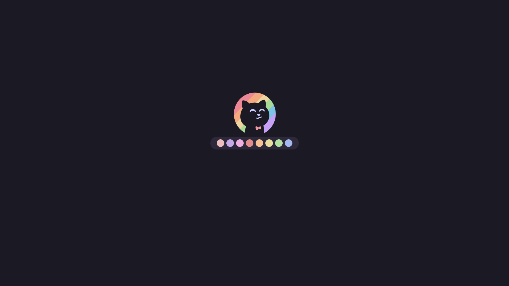
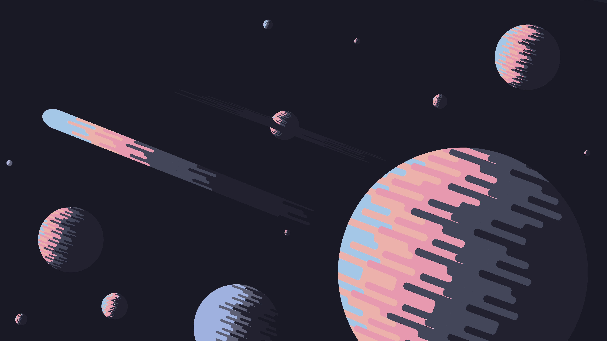
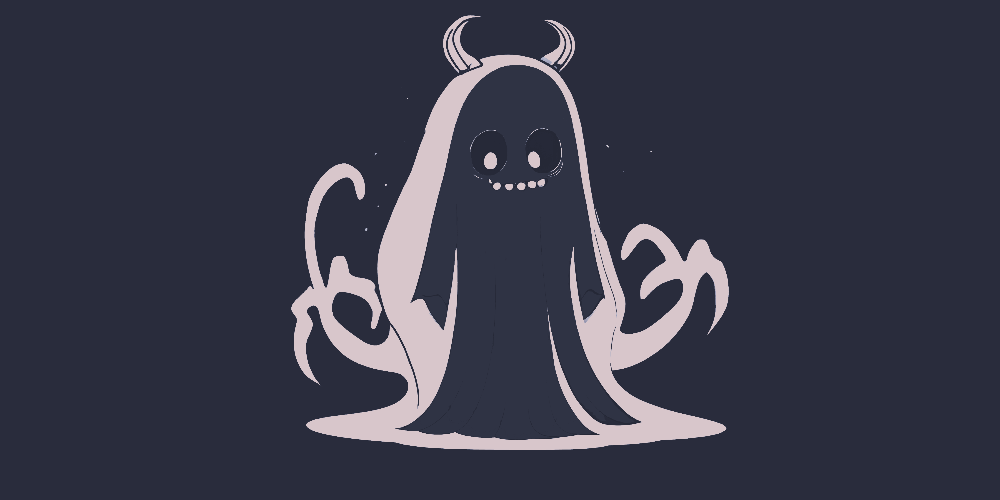
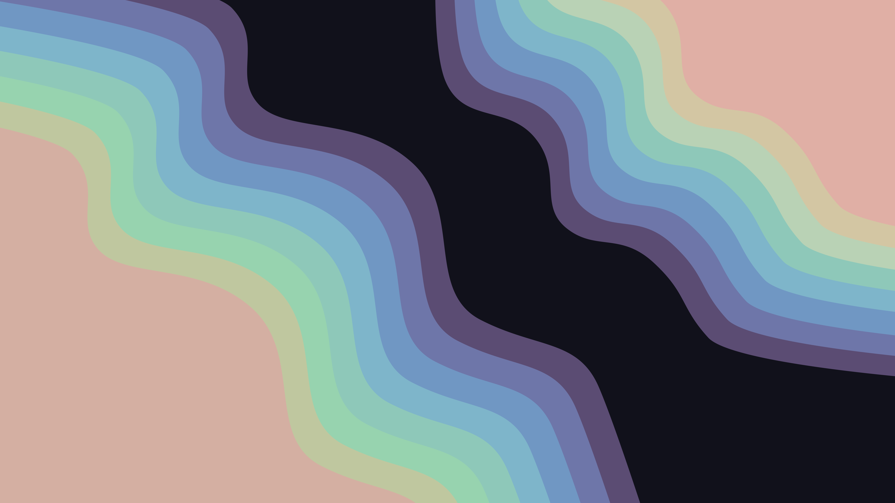

# Wallpapers :D
 THIS README IS AUTOGENERATED. You can view the code that does it in `markdown.py`

## Catppuccin

Mocha

**Tags:** `CatppuccinMocha` `ArchLinux`

**Tags:** `CatppuccinMocha` `Ghost`

**Tags:** `CatppuccinMocha` `Logo`

**Tags:** `CatppuccinMocha` `Rocket`

**Tags:** `CatppuccinMocha` `Saturn`

**Tags:** `CatppuccinMocha` `Space`

**Tags:** `CatppuccinMocha` `Error`

**Tags:** `CatppuccinMocha` `NightTimeCity`

**Tags:** `CatppuccinMocha` `Planets`

Macchiato

**Tags:** `CatppuccinMacchiato` `Ghost`

**Tags:** `CatppuccinMacchiato` `Saturn`

Frappe

**Tags:** `CatppuccinFrappe` `Ghost`

**Tags:** `CatppuccinFrappe` `Pacman`

Latte

## Unthemed

Cute

**Tags:** `RamenFox`

**Tags:** `Cute` `PinkDino`

**Tags:** `CutePokemon`

Minimal

**Tags:** `DarkCat`

**Tags:** `DesertNight`

**Tags:** `FullColor` `Waves`

**Tags:** `RightColored` `Waves`

**Tags:** `Teal` `Blobs`

**Tags:** `Waves`

**Tags:** `Alfa`

PixelArt

**Tags:** `Town`

Scenery

**Tags:** `AncientTempleValley`

**Tags:** `BlackHole`

**Tags:** `CherryBlossom` `Waterfalls`

**Tags:** `GrayTemple`

**Tags:** `Harmony`

**Tags:** `KoiMoon`

**Tags:** `LostBetween`

**Tags:** `MountainRuins`

**Tags:** `PeacefulPurpleTrees`

**Tags:** `PinkForestTemple`

**Tags:** `Stardust`

**Tags:** `Tranquility`

**Tags:** `VillageLandscape`

**Tags:** `SunsetTown`

**Tags:** `FantasyForest`

**Tags:** `CartoonSunset`

**Tags:** `Japanese` `RiverRain`

**Tags:** `Japanese` `RoundArchway`

**Tags:** `MountainsPoly`

**Tags:** `FishingStars`

**Tags:** `Couple` `Sunset` `Gif`

Other

**Tags:** `Pink` `Katana`

Character

**Tags:** `LofiGirl`

**Tags:** `AnimeChillPool`

StudioGhibli

**Tags:** `HowlsMovingCastle`

**Tags:** `Minimal` `Totoro`

## Nord

Nord

**Tags:** `Nord` `ArchChan`

**Tags:** `Nord` `Knight`

**Tags:** `Nord` `Planets`

**Tags:** `Nord` `Astronauts`

**Tags:** `Nord` `Orbit`

**Tags:** `Nord` `SpaceStation` `Astronaut`

**Tags:** `Nord` `Gif` `Futuristic`

**Tags:** `Nord` `Pacman`

**Tags:** `Nord` `Underwater`

